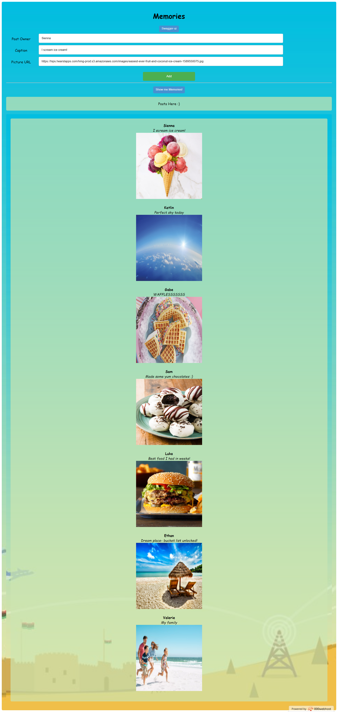

# Memories - A picture stream application
<!-- The App is called "Memories" and it is a simple social media MERN application that allows users to post interesting events that happened in their lives -->

A picture stream application is like a open social media app where users can post interesting events that happened in their lives by providing their name, a caption for the pivture and the URL for the picture image as input. 
The page retrieve and display the latest 100 posted pictures(memories) (names + images + caption).

This is not a photo generator, but a simple app to pull created photos using their URL and listing them on this page with the user’s name and caption.

URL - https://xmeme-priyal.000webhostapp.com/

# PHP REST API

This is a simple PHP REST API from scratch with no framework.


#### View on Docgen

* [URL](http://xmeme-priyal.000webhostapp.com/swagger-ui.html)
* LOCAL_URL - http://localhost/doc.html


# Quick Start

Import the xmemes.sql file, change the params in the config/Database.php file to your own

### Testing

### Posts

#### Create a Post

* Method - POST

* URL - https://xmeme-priyal.000webhostapp.com/create.php

* Sample Request

```
{
	"name": "ashok kumar",

	"url": "https://images.pexels.com/photos/3573382/pexels-photo-3573382.jpeg",

	"caption": "This is a meme"
}
```

* Sample Response

```
{
    "status": true,
    "message": "Post Created"
}
```

#### Get all Posts

* Method - GET

* URL - https://xmeme-priyal.000webhostapp.com/read.php

* Sample Response

```
{
    "status": true,
    "message": "Posts Found",
    "data": [

    {

	"id": "1",       

	"name": "MS Dhoni",

	"url": "https://images.pexels.com/photos/3573382/pexels-photo-3573382.jpeg",

	"caption": "Meme for my place"

    },

    {

	"id": "2",

	"name": "Viral Kohli",

	"url": "https://images.pexels.com/photos/1078983/pexels-photo-1078983.jpeg",

	"caption": "Another home meme"

    }

  ]

}
```

#### Get a Post

* Method - GET

* URL - https://xmeme-priyal.000webhostapp.com/read_single.php?id=1

* Sample Response

```
  {

	"id": "1",       

	"name": "MS Dhoni",

	"url": "https://images.pexels.com/photos/3573382/pexels-photo-3573382.jpeg",

	"caption": "Meme for my place"

    }
```

#### Update a Post

* Method - PATCH

* URL - https://xmeme-priyal.000webhostapp.com/update.php?id=2

* HEADER

```
{
    "Key": "Content-Type",
    "Value": "application/json"
}
```

* Sample Response

```
{

	"url": "new_url",

	"caption": "new_caption"

}
```

#### Delete a Post

* Method - DELETE

* URL - https://xmeme-priyal.000webhostapp.com/delete.php?id=2

* HEADER

```
{
    "Key": "Content-Type",
    "Value": "application/json"
}
```

* Sample Response

```
{
    "status": true,
    "message": "Post Deleted"
}
```



### Author

Priyal Dubey
[Priyal Dubey](https://xmeme-priyal.000webhostapp.com/)

### Version

1.0.0
